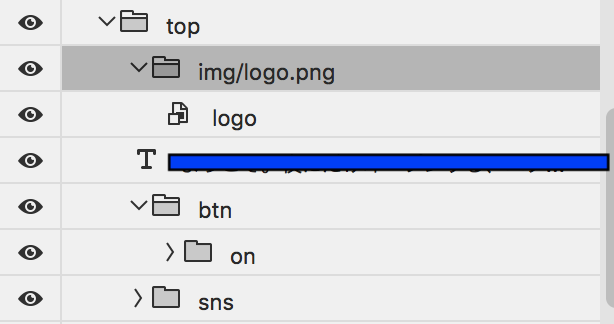
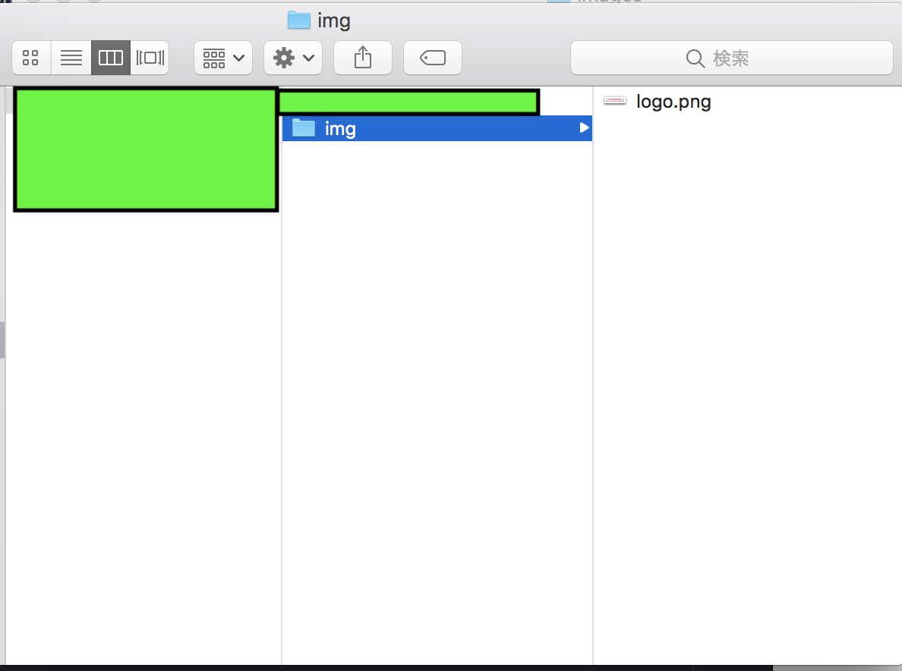

# これなに

webページの制作のデザインファイルの更新があった時に毎回psdダウンロードして、
アセットに名前つけてアセット書き出しして生成された画像をプロジェクトフォルダに移して
という作業につかれたのでそのストレスから開放されることを目標にする。

現状はinvision sync,google driveなどに入っている共有されたpsdから
自動でアセットが書き出されたものをプロジェクトフォルダにコピーするツール。
あとcss書く時に画像のサイズとか調べるのだるいので
画像のサイズデータをmixinで取得できるstylusの自動で生成、更新したりする。

スプライトシートとそれ用のstylusも自動で生成、更新するよ。

# 前提とするワークフロー

以下のルールを前提とする。

invision sync、google drive等でデザイナー、デベロッパーが同じフォルダを共有する。

デザイナーが初稿のデザインファイルをあげたら普通はデベロッパーがアセット書き出し用に
こんな感じで名前つける。



これをアセット書き出しにチェックを入れると



こんな感じで一式書き出される。

このxxxx-assets以下も含めて共有フォルダで共有する。

デザインに修正があったときはデザイナーは共有フォルダに入っているアセット命名済みの
ファイルを修正し、保存するとassets以下の素材も常に最新が入る。
※保存の時に毎回アセット書き出しされるのは,,,というときは作業中のみアセット書き出しのチェックを外す。作業完了時にアセットを書き出す。
※デザイナー、デベロッパーの作業が衝突しそうなときはコミュニケーションで解決する。

デベロッパーが書き出すファイルの命名規則として基本は
画像は`img/hoge.jpg`、スプライトは`sprite/hoge.png`とする。
※一応設定で変更できる。

# how to use

## init

`$ yarn install` or `$ npm install`

async/awaitとかつかってるのでnode.js v8~じゃないと動かない気がする

## use
`$ node .`

package.jsonにnpm scriptsでもつくって
各自の環境でビルド前に一回実行するみたいなのつくるか

## stylusファイル

### 画像の場合

```
$imagename_width = 341px
$imagename_height = 300px
$imagename_width_x2 = 170.5px
$imagename_height_x2 = 150px
$imagename = 341px 300px 170.5px 150px

imageSize($image)
  width: $image[0]
  height: $image[1]

imageSizeX2($image)
  width: $image[2]
  height: $image[3]
```

```
.hoge
  position: relative
  img
    imageSize($imagename)  
```
的なノリで使う。

### スプライトシートの場合
spritesmith(https://github.com/Ensighten/spritesmith)つかったので
こっちを参考に。

spritesmithにはretina用のmixinが入ったstylusが書き出されないのでそれだけオリジナルで書き出した。

## config

`index.js`の中にconfigという変数があるのでそれを環境ごとに変える

```
const config = {
  baseDir: "/Users/***/InVision/***@****.com/your_project_name/Assets/Source Files", //psdが入っているルートディレクトリ(google driveの)
  psdNames: ["01_Home", "01_Home_sp"], //対象psdリスト
  imageDirName: "img", //psd書き出すときの対象フォルダ名(画像)
  spriteDirName: "sprite", //psd書き出すときの対象フォルダ名(sprite)
  imageDestPath: "source/assets/img", //画像吐き出し先
  styleDestPath: "source/style/mixins", //stylus吐き出し先
  imageRelativePath: "../img/sprite/", //css spriteが参照する画像のパス(background-image: url(../hoge.png)のprefix)
}
```

### baseDir
invision, driveのpsdが入っているルートフォルダ
相対パスでも絶対パスでもいいはず。

### psdNames
対象とするpsdの名前を配列で定義する。

### imageDirName
psdファイル内でアセットに名前をつけるときのフォルダ名(画像用)
${imageDirName}/hoge.jpg

### spriteDirName
psdファイル内でアセットに名前をつけるときのフォルダ名(sprite sheet用)
${spriteDirName}/hoge.png

### imageDestPath
画像吐き出し先、自分のサイト制作環境のimgフォルダのパス
※スプライトシートは ${imageDestPath}/spire 以下に入る

### styleDestPath
画像吐き出し先、自分のサイト制作環境のstylusフォルダのパス
現状stulusしか対応していない
※スプライトシートは ${styleDestPath}/spire 以下に入る

### imageRelativePath
スプライトシート用のstylusに記述されるbackground-imageの相対パス

# todo

svgどうしよう。。。
そもそもsvgをつかうならデザインの作り方等からデザイナーと相談する必要を感じる。
